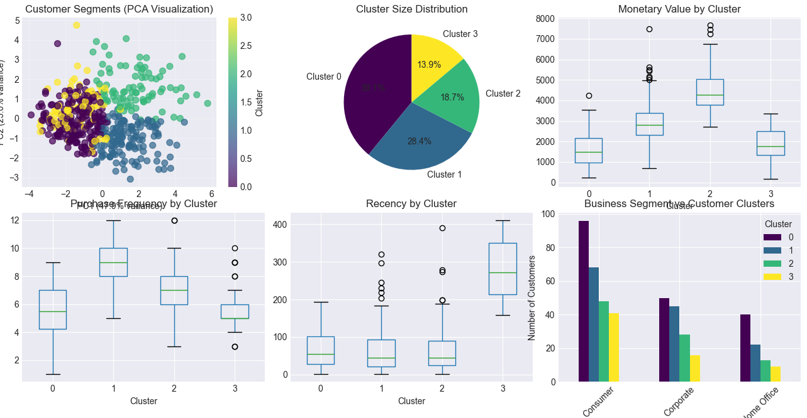
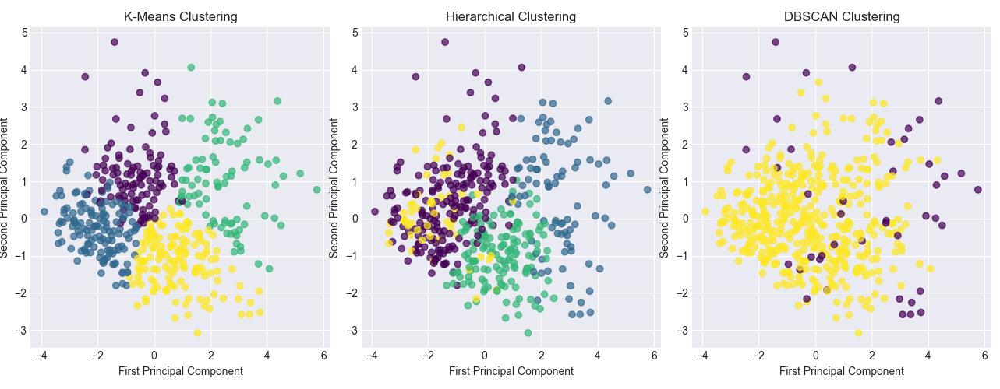
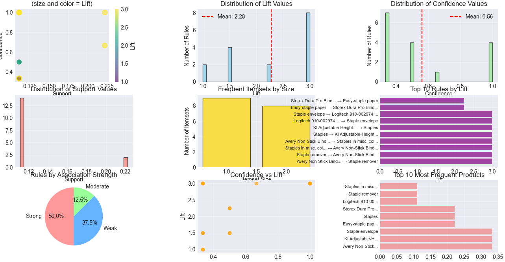
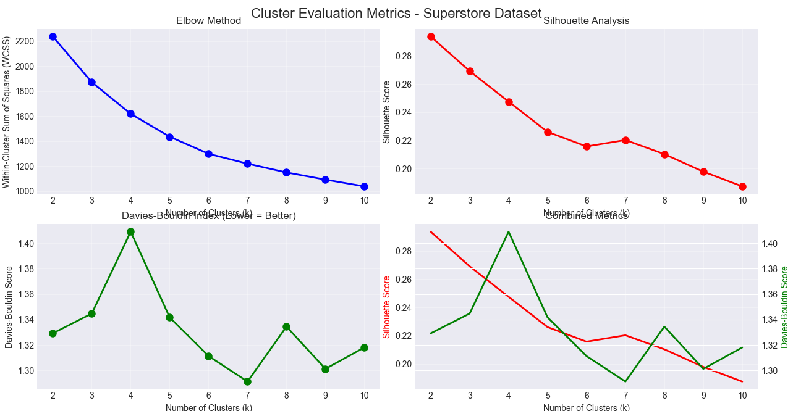

# 🛍️ Customer Segmentation & Market Basket Analysis (Superstore Dataset)

## 📌 Project Overview
This project implements a **Customer Segmentation** and **Market Basket Analysis** pipeline using the **Sample Superstore dataset**. 
It leverages advanced clustering, association rule mining, and interactive visualizations to provide actionable business insights.

The solution includes:
- **Data preprocessing & feature engineering**
- **K-Means clustering with optimal K selection**
- **Market basket analysis with Apriori algorithm**
- **Persona creation & segment-level strategies**
- **Interactive Streamlit dashboard** for exploration

---

## 📂 Repository Structure

```
.
├── images/                                   # Output images used in README and reports
│   ├── customer_segmentation_cluster_analysis.png
│   ├── customer_segmentation_methods_comparison.png
│   ├── market_basket_analysis_association_rules_summary.png
│   ├── superstore_cluster_evaluation_metrics.png
├── association_rules_20250812_103316.csv     # Latest association rules
├── cluster_centers_20250812_103316.csv       # Latest cluster centers
├── customer_segments_20250812_103316.csv    # Customer segmentation results
├── segment_performance_20250812_103316.csv  # Segment performance summary
├── data_loading_model_train_testing.py       # Data processing & analysis logic
├── superstore_app.py                         # Streamlit dashboard
├── requirements.txt                          # Python dependencies
├── Sample-Superstore.csv                     # Dataset
```

---

## ⚙️ Features from `data_loading_model_train_testing.py`
- **Data loading & cleaning**
- **RFM Feature Engineering**: Recency, Frequency, Monetary
- **Additional Behavioral Features**: Avg order value, category diversity, profit per order
- **Optimal K-Means selection** using:
  - Elbow method
  - Silhouette score
  - Davies-Bouldin index
- **Cluster interpretation & persona generation**
- **Market Basket Analysis**:
  - Apriori algorithm for frequent itemsets
  - Association rule generation (support, confidence, lift)
- **Seasonal trend analysis**
- **Results export** to CSV

---

## 🎛 Features from `superstore_app.py` (Streamlit Dashboard)
- **Navigation Hub** with modular tabs:
  - 📂 **Data Source** – upload or use sample dataset
  - 👥 **Customer Segmentation** – visual clusters, persona insights, segment KPIs
  - 🛒 **Market Basket Analysis** – association rule explorer
  - 📊 **Segment Performance** – revenue, profit, AOV per segment
  - 📈 **Cluster Evaluation** – elbow, silhouette, Davies-Bouldin plots
- **Downloadable outputs**: Segmentation results, association rules, performance summaries
- **Interactive visualizations** powered by Plotly
- **Image embedding** of analysis results

---

## 📊 Key Visuals

### 1️⃣ Customer Segmentation Clusters


### 2️⃣ Clustering Method Comparisons


### 3️⃣ Market Basket Analysis Summary


### 4️⃣ Cluster Evaluation Metrics


---

## 🚀 How to Run

### 1. Install dependencies
```bash
pip install -r requirements.txt
```

### 2. Run the Streamlit app
```bash
streamlit run superstore_app.py
```

### 3. Upload your own dataset (or use provided `Sample-Superstore.csv`)

---

## 📦 Outputs Generated
- **customer_segments_*.csv** → Customer clusters & metrics
- **association_rules_*.csv** → Market basket rules
- **segment_performance_*.csv** → Segment-level performance
- **cluster_centers_*.csv** → Cluster feature centers

---

## 📌 Business Value
This system helps:
- **Marketing teams** → Target campaigns by segment
- **Merchandisers** → Identify product bundling opportunities
- **Executives** → See high-level customer value distribution

---


---

## Database and Deploy

- **Data set** → https://www.kaggle.com/datasets/vivek468/superstore-dataset-final/suggestions
- **Cloud ** → """"
- **github** → "" ""

---


## 📄 License
This project is for educational purposes

---

---

## Apu Datta
Baruch College (CUNY)
email: uda.mr.iub@gmail.com

---